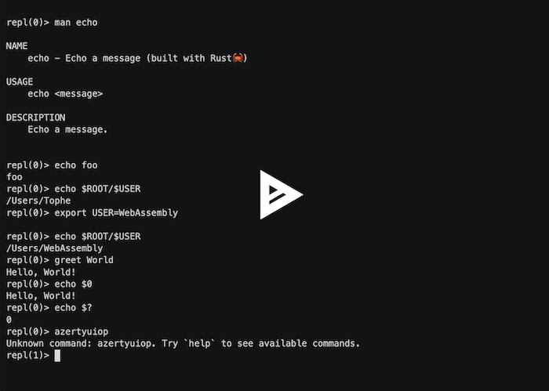

# WebAssembly Component Model Experiments

[](https://crates.io/crates/pluginlab)
[](https://topheman.github.io/webassembly-component-model-experiments/)
[](https://dev.to/topheman/webassembly-component-model-building-a-plugin-system-58o0)

I wrote a blog post that goes in much more details and is accessible to a wider audience: [Building a plugin system with WebAssembly Component Model](https://dev.to/topheman/webassembly-component-model-building-a-plugin-system-58o0).

> The WebAssembly Component Model is a broad-reaching architecture for building interoperable WebAssembly libraries, applications, and environments.

It is still very early days, but it is a very promising technology. However, the examples out there are either too simple or too complex.

The goal of this project is to demonstrate the power of the WebAssembly Component Model, with more than a simple hello world.

It is a basic REPL, with a plugin system where:

- plugins can be written in any language compiling to WebAssembly
- plugins are sandboxed by default
- the REPL logic is written in Rust, it also compiles to WebAssembly (you could swap it for your implementation in your own language)

There are two kinds of hosts:

- a CLI host `pluginlab`, written in Rust running in a terminal
- a web host, written in TypeScript running in a browser

Those hosts then run the same codebase which is compiled to WebAssembly:

- the REPL logic
- the plugins (made a few in rust, C, Go, and TypeScript)

Security model: the REPL cli implements a security model inspired by [deno](https://docs.deno.com/runtime/fundamentals/security/#permissions):

- `--allow-net`: allows network access to the plugins, you can specify a list of domains comma separated (by default, no network access is allowed)
- `--allow-read`: allows read access to the filesystem
- `--allow-write`: allows write access to the filesystem
- `--allow-all`: allows all permissions (same as all the flags above), short: `-A`

Plugins are sandboxed by default - they cannot access the filesystem or network unless explicitly permitted. This allows safe execution of untrusted plugins while maintaining the flexibility to grant specific permissions when needed.

Plugins like `ls` or `cat` can interact with the filesystem using the primitives of the languages they are written in.

- on the CLI, a folder from the disk is mounted via the `--dir` flag
- on the browser, a virtual filesystem is mounted, the I/O operations are forwarded via a [local fork](./packages/web-host/overrides/@bytecodealliance/preview2-shim) of `@bytecodealliance/preview2-shim/filesystem` shim, which shims the `wasi:filesystem` filesystem interface

<p align="center"><a href="https://topheman.github.io/webassembly-component-model-experiments/"></a></p>
<p align="center">
  Check the online demo at<br/><a href="https://topheman.github.io/webassembly-component-model-experiments/">topheman.github.io/webassembly-component-model-experiments</a>
</p>

<p align="center">
  Example of running the CLI <code>pluginlab</code>
  <a href="https://asciinema.org/a/733915?speed=2" title="Click to watch the demo">
    
  </a>
</p>

## Previous work with WebAssembly

In the last seven years I've done a few projects involving rust and WebAssembly:

- [topheman/bevy-rust-wasm-experiments](https://github.com/topheman/bevy-rust-wasm-experiments): Proof of concept that aims to demonstrate how to code a video game in rust that compiles both to a binary file and a web site (via WebAssembly, binding the accelerometer and gyroscope sensors from the mobile device)
- [topheman/webassembly-wasi-experiments](https://github.com/topheman/webassembly-wasi-experiments): Discover WebAssembly System Interface (WASI) with C/Rust targetting NodeJS, python, Wasmtime and the browser
- [topheman/rust-wasm-experiments](https://github.com/topheman/rust-wasm-experiments): Discover how to use Rust to generate WebAssembly, called by JavaScript
  - [📺🇫🇷 Utiliser WebAssembly, dès aujourd'hui - ParisJS #86](https://www.youtube.com/watch?v=F3wOfWIFzVc&list=PLWhFHBFsRtquZ6hVXVjXmJ-l51ZXuSBtb)


## Usage

### pluginlab (rust) - REPL cli host

#### Install the binary

**Using cargo (from source)**

```bash
cargo install pluginlab
```

**Using homebrew**

```bash
brew install topheman/tap/pluginlab
```

#### Run

```bash
pluginlab\
  --repl-logic https://topheman.github.io/webassembly-component-model-experiments/plugins/repl_logic_guest.wasm\
  --plugins https://topheman.github.io/webassembly-component-model-experiments/plugins/plugin_greet.wasm\
  --plugins https://topheman.github.io/webassembly-component-model-experiments/plugins/plugin_ls.wasm\
  --plugins https://topheman.github.io/webassembly-component-model-experiments/plugins/plugin_echo.wasm\
  --plugins https://topheman.github.io/webassembly-component-model-experiments/plugins/plugin_weather.wasm\
  --plugins https://topheman.github.io/webassembly-component-model-experiments/plugins/plugin_cat.wasm\
  --plugins https://topheman.github.io/webassembly-component-model-experiments/plugins/plugin_tee.wasm\
  --plugins https://topheman.github.io/webassembly-component-model-experiments/plugins/plugin-echo-c.wasm\
  --plugins https://topheman.github.io/webassembly-component-model-experiments/plugins/plugin-echo-go.wasm\
  --allow-all
```

Other flags:

- `--dir`: directory to be preopened (by default, the current directory)
- `--allow-net`: allows network access to the plugins, you can specify a list of domains comma separated (by default, no network access is allowed)
- `--allow-read`: allows read access to the filesystem
- `--allow-write`: allows write access to the filesystem
- `--allow-all`: allows all permissions (same as all the flags above), short: `-A`
- `--help`: displays manual
- `--debug`: run the host in debug mode (by default, the host runs in release mode)

<details>
<summary>🚀 Example of running the CLI host</summary>
<pre>
pluginlab\
  --repl-logic https://topheman.github.io/webassembly-component-model-experiments/plugins/repl_logic_guest.wasm\
  --plugins https://topheman.github.io/webassembly-component-model-experiments/plugins/plugin_greet.wasm\
  --plugins https://topheman.github.io/webassembly-component-model-experiments/plugins/plugin_ls.wasm\
  --plugins https://topheman.github.io/webassembly-component-model-experiments/plugins/plugin_echo.wasm\
  --plugins https://topheman.github.io/webassembly-component-model-experiments/plugins/plugin_weather.wasm\
  --plugins https://topheman.github.io/webassembly-component-model-experiments/plugins/plugin_cat.wasm\
  --plugins https://topheman.github.io/webassembly-component-model-experiments/plugins/plugin_tee.wasm\
  --plugins https://topheman.github.io/webassembly-component-model-experiments/plugins/plugin-echo-c.wasm\
  --plugins https://topheman.github.io/webassembly-component-model-experiments/plugins/plugin-echo-go.wasm\
  --allow-all
[Host] Starting REPL host...
[Host] Loading REPL logic from: https://topheman.github.io/webassembly-component-model-experiments/plugins/repl_logic_guest.wasm
[Host] Loading plugin: https://topheman.github.io/webassembly-component-model-experiments/plugins/plugin_greet.wasm
[Host] Loading plugin: https://topheman.github.io/webassembly-component-model-experiments/plugins/plugin_ls.wasm
[Host] Loading plugin: https://topheman.github.io/webassembly-component-model-experiments/plugins/plugin_echo.wasm
[Host] Loading plugin: https://topheman.github.io/webassembly-component-model-experiments/plugins/plugin_weather.wasm
[Host] Loading plugin: https://topheman.github.io/webassembly-component-model-experiments/plugins/plugin_cat.wasm
[Host] Loading plugin: https://topheman.github.io/webassembly-component-model-experiments/plugins/plugin_tee.wasm
[Host] Loading plugin: https://topheman.github.io/webassembly-component-model-experiments/plugins/plugin-echo-c.wasm
[Host] Loading plugin: https://topheman.github.io/webassembly-component-model-experiments/plugins/plugin-echo-go.wasm
repl(0)> echo foo
foo
repl(0)> echo $ROOT/$USER
/Users/Tophe
repl(0)> export FOO=toto

repl(0)> echo $FOO
toto
repl(0)> greet $FOO
Hello, toto!
repl(0)> ls wit
wit/host-api.wit
wit/plugin-api.wit
wit/shared.wit
repl(0)> weather Paris
Sunny
repl(0)> weather New York
Partly cloudy
repl(0)> azertyuiop
Unknown command: azertyuiop. Try `help` to see available commands.
repl(1)> echo $?
1
repl(0)> greet $USER
Hello, Tophe!
repl(0)> echo $0
Hello, Tophe!
repl(0)>
</pre>
</details>

### web-host (typescript)

Go check [topheman.github.io/webassembly-component-model-experiments](https://topheman.github.io/webassembly-component-model-experiments) online demo.

## Development

### Prerequisites

- Rust 1.87+
- Node.js 22.6.0+ (needs `--experimental-strip-types` flag)
- Go 1.25+
- [just](https://github.com/casey/just?tab=readme-ov-file#installation)

### Setup

```bash
# Add WebAssembly targets
rustup target add wasm32-unknown-unknown wasm32-wasip1
```

```bash
# Install project dependencies (web part)
npm install
# Install Playwright browsers (e2e tests for web-host)
npx playwright install
```

```bash
# Install cargo component subcommand
cargo binstall cargo-component
```

#### C tooling

[From the WebAssembly Component Model section for C tooling](https://component-model.bytecodealliance.org/language-support/c.html)

```bash
# Initialize the .env file tracking the WASI SDK version for C development
# You will be asked to update the WASI_OS and WASI_ARCH variables if needed
just init-env-file
```

```bash
cargo install wit-bindgen-cli@0.44.0
```

```bash
# Install the wasm-tools tool - you can also use cargo install wasm-tools@1.235.0 if you don't have cargo-binstall
cargo binstall wasm-tools@1.235.0
```

```bash
# Download the WASI SDK into ./c_deps/wasi-sdk folder
just dl-wasi-sdk
```

#### Go tooling

[From the WebAssembly Component Model section for Go tooling](https://component-model.bytecodealliance.org/language-support/go.html)

- Install [TinyGo](https://tinygo.org/getting-started/install/)
- Install [wasm-tools](https://github.com/bytecodealliance/wasm-tools) - same as C
- Install [wkg](https://github.com/bytecodealliance/wasm-pkg-tools)
  ```bash
  cargo binstall wkg
  ```

### pluginlab (rust) - REPL cli host

#### Build

```bash
just build
```

This will (see [justfile](./justfile)):

- compile the pluginlab crate from rust to a binary file
- compile the repl-logic-guest crate from rust to wasm
- compile the plugin-* crates from rust to wasm
- compile the c_modules/plugin-* C plugins to wasm

#### Run

```bash
./target/debug/pluginlab\
  --repl-logic ./target/wasm32-wasip1/debug/repl_logic_guest.wasm\
  --plugins ./target/wasm32-wasip1/debug/plugin_greet.wasm\
  --plugins ./target/wasm32-wasip1/debug/plugin_ls.wasm\
  --plugins ./target/wasm32-wasip1/debug/plugin_echo.wasm\
  --plugins ./target/wasm32-wasip1/debug/plugin_weather.wasm\
  --plugins ./target/wasm32-wasip1/debug/plugin_cat.wasm\
  --plugins ./target/wasm32-wasip1/debug/plugin_tee.wasm\
  --plugins ./c_modules/plugin-echo/plugin-echo-c.wasm\
  --plugins ./go_modules/plugin-echo/plugin-echo-go.wasm\
  --allow-all
```

This will run the `pluginlab` binary which will itself:

- load and compile the `repl_logic_guest.wasm` file inside the embedded `wasmtime` engine injecting the [`host-api`](./crates/pluginlab/wit/host-api.wit) interface
- load and compile the `plugin*.wasm` files passed via `--plugins` into the engine, injecting the [`plugin-api`](./crates/pluginlab/wit/plugin-api.wit) interface
- launch the REPL loop executing the code from the `repl_logic_guest.wasm` file which will:
  - readline from the user
  - parse the command
  - dispatch the command to the plugin(s) if needed (run the `run`, `man` functions of the plugins via the [`host-api`](./crates/pluginlab/wit/host-api.wit) interface)
  - display the result

Other example:

```bash
./target/debug/pluginlab\
  --repl-logic ./target/wasm32-wasip1/debug/repl_logic_guest.wasm\
  --plugins ./target/wasm32-wasip1/debug/plugin_ls.wasm\
  --plugins ./target/wasm32-wasip1/debug/plugin_echo.wasm\
  --dir /tmp\
  --allow-all
```

#### Test

```bash
# Runs unit tests and e2e tests on the REPL
just test
```

```bash
# Runs e2e tests on the REPL against the latest version of the plugins available at https://topheman.github.io/webassembly-component-model-experiments/plugins
# Launch to check for breaking changes with the WIT interface
just test-e2e-pluginlab-http-latest
```

#### Make a rust plugin

```bash
cargo component new --lib crates/plugin-hello
```

#### Publish

```bash
# Dry run
just publish-pluginlab-dry-run
```

Once you're happy with the changes, you can publish the pluginlab crate:

```bash
just publish-pluginlab
```

### web-host (typescript)

#### Dev

```bash
npm run web-host:dev
```

This Will (see [packages/web-host/package.json](./packages/web-host/package.json)):

- generate types from the [wit](./wit) files using the [jco](https://github.com/bytecodealliance/jco) tool
- build the plugins from rust to wasm (so that you don't have to do it manually)
- build the repl-logic-guest from rust to wasm (so that you don't have to do it manually)
- copy the wasm files in `target/wasm32-wasip1/release` to the `packages/web-host/public/plugins` directory (to make them available via http for the `pluginlab` binary)
- transpile the wasm files to javascript using the [jco](https://github.com/bytecodealliance/jco) tool into `packages/web-host/src/wasm/generated/*/transpiled` (this is the glue code wrapping the wasm files which is needed to interact with in the browser or node)
- start the vite dev server

Go to [http://localhost:5173](http://localhost:5173) to see the web host.

#### Build

```bash
npm run web-host:build
```

Will do the same as the dev command, small changes:

- the build tasks called on the rust side are `just *-release` (release mode)
- it doesn't start the vite dev server, it builds the static files in the `dist` directory

You can then run `npm run web-host:preview` to preview the build.

#### Test

The project is configured to run e2e tests on the `web-host` using [playwright](./packages/web-host/playwright.config.ts), the test files are in [`packages/web-host/tests`](./packages/web-host/tests).

To run the tests against your local dev server (launched with `npm run dev`)

- `npm run test:e2e:all`: will run all the tests in headless mode
- `npm run test:e2e:ui`: will open the playwright ui to run the tests

To run the tests against a preview server (build with `npm run build` and launched with `npm run preview`):

- `npm run test:e2e:all:preview`: will run all the tests in headless mode
- `npm run test:e2e:ui:preview`: will open the playwright ui to run the tests

Specific to github actions:

In [`.github/workflows/web-host.yml`](./.github/workflows/web-host.yml), after the build step, the tests are run against the preview server.

To be sure that the preview server is up and running before running the tests, we use the [`webServer.command` option](https://playwright.dev/docs/test-webserver) of [playwright.config.ts](./packages/web-host/playwright.config.ts) to run `WAIT_FOR_SERVER_AT_URL=http://localhost:4173/webassembly-component-model-experiments/ npm run test:e2e:all:preview`

### plugins

There are currently plugins implemented in 3 languages (most of them are in rust), their toolchain is already setup in the project, you just have to write the plugin code and run `just build`.

#### Rust

You can write plugins in rust in [`crates/plugin-*`](./crates).

#### C

You can write plugins in C in [`c_modules/plugin-*`](./c_modules), thanks to `wit-bindgen` (based on [wit-bindgen](https://github.com/bytecodealliance/wit-bindgen)).

#### Go

You can write plugins in Go in [`go_modules/plugin-*`](./go_modules), thanks to [TinyGo Compiler](https://tinygo.org/getting-started/install/).

#### TypeScript

You can also write plugins in TypeScript in [`packages/plugin-*`](./packages), thanks to `jco componentize` (based on [componentize-js](https://github.com/bytecodealliance/componentize-js)).

The downsides of writing plugins in TypeScript is mostly that your `.wasm` file will be **much larger** than the one compiled from rust or C:

- ~100KB of wasm for the rust plugin
- 11MB of wasm for the TypeScript plugin

The reason is that a JavaScript runtime needs to be embedded in the `.wasm` file, which is not the case for the rust plugin.

More about the [SpiderMonkey runtime embedding](https://github.com/bytecodealliance/ComponentizeJS?tab=readme-ov-file#explainer).

#### Other languages

Coming.

## CI

### Testing

The `pluginlab` binary is built and tested e2e (using `rexpect` library).

The `web-host` is built and tested e2e (using [playwright](https://playwright.dev/)).

### Deployment

The `web-host` is automatically deployed to github pages when pushed on the `master` branch, containing the latest `wasm` versions of the plugins available at https://topheman.github.io/webassembly-component-model-experiments/plugins.

### Pre-release

https://github.com/topheman/webassembly-component-model-experiments/releases

When a git tag is pushed, a pre-release is prepared on github, linked to the tag, containing the `wasm` files for the plugins and the repl-logic, in order to version those. That way, you can use an old binary of `pluginlab` against the correct versions of the plugins:

```sh
pluginlab\
  --repl-logic https://github.com/topheman/webassembly-component-model-experiments/releases/download/pluginlab@0.5.2/repl_logic_guest.wasm\
  --plugins https://github.com/topheman/webassembly-component-model-experiments/releases/download/pluginlab@0.5.2/plugin_greet.wasm\
  --plugins https://github.com/topheman/webassembly-component-model-experiments/releases/download/pluginlab@0.5.2/plugin_ls.wasm\
  --plugins https://github.com/topheman/webassembly-component-model-experiments/releases/download/pluginlab@0.5.2/plugin_echo.wasm\
  --plugins https://github.com/topheman/webassembly-component-model-experiments/releases/download/pluginlab@0.5.2/plugin_weather.wasm\
  --plugins https://github.com/topheman/webassembly-component-model-experiments/releases/download/pluginlab@0.5.2/plugin_cat.wasm\
  --plugins https://github.com/topheman/webassembly-component-model-experiments/releases/download/pluginlab@0.5.2/plugin_tee.wasm\
  --plugins https://github.com/topheman/webassembly-component-model-experiments/releases/download/pluginlab@0.5.2/plugin-echo-c.wasm\
  --plugins https://github.com/topheman/webassembly-component-model-experiments/releases/download/pluginlab@0.5.2/plugin-echo-go.wasm\
  --allow-all
```

## Developer experience

### Formating and linting

- I use [biome](https://biomejs.dev/) for formating and linting the TypeScript code
- I use cargo fmt for formating the rust code
- They are both configured to run on save in the editor

### Git hooks

- I use [husky](https://github.com/typicode/husky) to run lint-staged on pre-commit
- I use [lint-staged](https://github.com/okonet/lint-staged) to run linting and formating on the changed files - the following are automatically run on pre-commit:
  - formating / linting the TypeScript code
  - formating the rust code
  - typechecking the TypeScript code

### Local fork of `@bytecodealliance/preview2-shim`

- The original [`@bytecodealliance/preview2-shim`](https://github.com/bytecodealliance/jco/tree/main/packages/preview2-shim) for the **browser** doesn't support **WRITE** operations on the filesystem
- A fork was created in [`packages/web-host/overrides/@bytecodealliance/preview2-shim`](./packages/web-host/overrides/@bytecodealliance/preview2-shim) to fix this issue

Everything is described in [PR#15 Support plugin-tee in the web host](https://github.com/topheman/webassembly-component-model-experiments/pull/15) (must read 😉).

## Resources

### Optional tools

Those are **optional** tools that are handy for WebAssembly development:

- [cargo-binstall](https://github.com/cargo-bins/cargo-binstall?tab=readme-ov-file#installation)
- [cargo component 0.21.1+](https://github.com/bytecodealliance/cargo-component?tab=readme-ov-file#installation)
- [wasm-tools 1.235.0](https://github.com/bytecodealliance/wasm-tools?tab=readme-ov-file#installation)
- [wasm-opt 116](https://github.com/WebAssembly/binaryen?tab=readme-ov-file#installation)
- [wit-bindgen-cli 0.44.0](https://github.com/bytecodealliance/wit-bindgen)

```bash
# latest versions
cargo binstall cargo-component wasm-tools wasm-opt
```

```bash
# specific versions I used for this project
cargo binstall cargo-component@0.21.1 wasm-tools@1.235.0 wasm-opt@116
```

### C tooling

- [From the WebAssembly Component Model section for C tooling](https://component-model.bytecodealliance.org/language-support/c.html)
- [WASI SDK](https://github.com/WebAssembly/wasi-sdk)
- [WIT Bindgen](https://github.com/bytecodealliance/wit-bindgen)

### Go tooling

- [From the WebAssembly Component Model section for Go tooling](https://component-model.bytecodealliance.org/language-support/go.html)
- [TinyGo Compiler](https://tinygo.org/getting-started/install/)
- [wasm-tools](https://github.com/bytecodealliance/wasm-tools)
- [wkg](https://github.com/bytecodealliance/wasm-pkg-tools)
