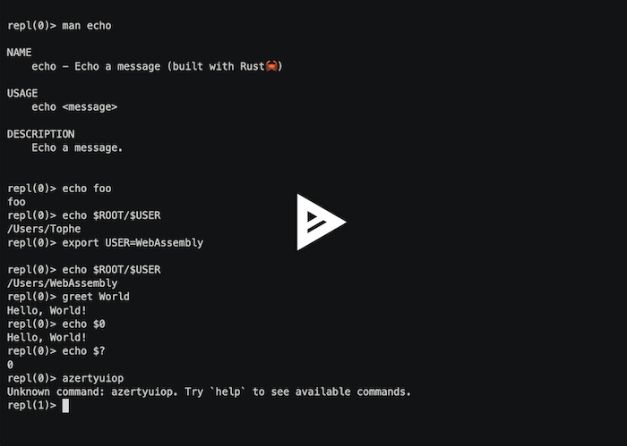

# pluginlab

Command-line interface host for Terminal REPL with plugin system (using WebAssembly Component Model).

The goal of this project is to demonstrate the power of the WebAssembly Component Model, with more than a simple hello world.

It is a basic REPL, with a plugin system where:

- plugins can be written in any language compiling to WebAssembly
- plugins are sandboxed by default
- the REPL logic is written in Rust, it also compiles to WebAssembly

There are two kinds of hosts:

- a **CLI host**, written in Rust running in a terminal **(this crate)**
- a web host, written in TypeScript running in a browser (see online demo at [topheman.github.io/webassembly-component-model-experiments](https://topheman.github.io/webassembly-component-model-experiments))

Those hosts then run the same codebase which is compiled to WebAssembly:

- the REPL logic
- the plugins (made a few in rust, C and TypeScript)

Security model: the REPL cli implements a security model inspired by [deno](https://docs.deno.com/runtime/fundamentals/security/#permissions):

- `--allow-net`: allows network access to the plugins, you can specify a list of domains comma separated (by default, no network access is allowed)
- `--allow-read`: allows read access to the filesystem
- `--allow-write`: allows write access to the filesystem
- `--allow-all`: allows all permissions (same as all the flags above), short: `-A`

Plugins are sandboxed by default - they cannot access the filesystem or network unless explicitly permitted. This allows safe execution of untrusted plugins while maintaining the flexibility to grant specific permissions when needed.

Plugins like `ls` or `cat` can interact with the filesystem using the primitives of the languages they are written in.

- on the CLI, a folder from the disk is mounted via the `--dir` flag
- on the browser, a virtual filesystem is mounted, the I/O operations are forwarded via the `@bytecodealliance/preview2-shim/filesystem` shim, which shims the `wasi:filesystem` filesystem interface

More details on the github repo: [topheman/webassembly-component-model-experiments](https://github.com/topheman/webassembly-component-model-experiments).

<p align="center">
  Example of running the CLI <code>pluginlab</code>
  <a href="https://asciinema.org/a/733915?speed=1.5" title="Click to watch the demo">
    
  </a>
</p>

## Install

```bash
cargo install pluginlab
```

## Usage

Run the CLI host, loading the latest versions of the plugins from the web (you can also load them from local files).

```bash
pluginlab\
  --repl-logic https://topheman.github.io/webassembly-component-model-experiments/plugins/repl_logic_guest.wasm\
  --plugins https://topheman.github.io/webassembly-component-model-experiments/plugins/plugin_greet.wasm\
  --plugins https://topheman.github.io/webassembly-component-model-experiments/plugins/plugin_ls.wasm\
  --plugins https://topheman.github.io/webassembly-component-model-experiments/plugins/plugin_echo.wasm\
  --plugins https://topheman.github.io/webassembly-component-model-experiments/plugins/plugin_weather.wasm\
  --plugins https://topheman.github.io/webassembly-component-model-experiments/plugins/plugin_cat.wasm\
  --plugins https://topheman.github.io/webassembly-component-model-experiments/plugins/plugin_tee.wasm\
  --plugins https://topheman.github.io/webassembly-component-model-experiments/plugins/plugin-echo-c.wasm\
  --allow-all
```

Other flags:

- `--dir`: directory to be preopened (by default, the current directory)
- `--allow-net`: allows network access to the plugins, you can specify a list of domains comma separated (by default, no network access is allowed)
- `--allow-read`: allows read access to the filesystem
- `--allow-write`: allows write access to the filesystem
- `--allow-all`: allows all permissions (same as all the flags above), short: `-A`
- `--help`: displays manual
- `--debug`: run the host in debug mode (by default, the host runs in release mode)

<details>
<summary>🚀 Example of running the CLI host</summary>
<pre>
pluginlab\
  --repl-logic https://topheman.github.io/webassembly-component-model-experiments/plugins/repl_logic_guest.wasm\
  --plugins https://topheman.github.io/webassembly-component-model-experiments/plugins/plugin_greet.wasm\
  --plugins https://topheman.github.io/webassembly-component-model-experiments/plugins/plugin_ls.wasm\
  --plugins https://topheman.github.io/webassembly-component-model-experiments/plugins/plugin_echo.wasm\
  --plugins https://topheman.github.io/webassembly-component-model-experiments/plugins/plugin_weather.wasm\
  --plugins https://topheman.github.io/webassembly-component-model-experiments/plugins/plugin_cat.wasm\
  --plugins https://topheman.github.io/webassembly-component-model-experiments/plugins/plugin_tee.wasm\
  --plugins https://topheman.github.io/webassembly-component-model-experiments/plugins/plugin-echo-c.wasm\
  --allow-all
[Host] Starting REPL host...
[Host] Loading REPL logic from: https://topheman.github.io/webassembly-component-model-experiments/plugins/repl_logic_guest.wasm
[Host] Loading plugin: https://topheman.github.io/webassembly-component-model-experiments/plugins/plugin_greet.wasm
[Host] Loading plugin: https://topheman.github.io/webassembly-component-model-experiments/plugins/plugin_ls.wasm
[Host] Loading plugin: https://topheman.github.io/webassembly-component-model-experiments/plugins/plugin_echo.wasm
[Host] Loading plugin: https://topheman.github.io/webassembly-component-model-experiments/plugins/plugin_weather.wasm
[Host] Loading plugin: https://topheman.github.io/webassembly-component-model-experiments/plugins/plugin_cat.wasm
repl(0)> echo foo
foo
repl(0)> echo $ROOT/$USER
/Users/Tophe
repl(0)> export FOO=toto

repl(0)> echo $FOO
toto
repl(0)> greet $FOO
Hello, toto!
repl(0)> ls wit
wit/host-api.wit
wit/plugin-api.wit
wit/shared.wit
repl(0)> weather Paris
Sunny
repl(0)> weather New York
Partly cloudy
repl(0)> azertyuiop
Unknown command: azertyuiop. Try `help` to see available commands.
repl(1)> echo $?
1
repl(0)> greet $USER
Hello, Tophe!
repl(0)> echo $0
Hello, Tophe!
repl(0)>
</pre>
</details>

### Versioning

The plugins are also versioned in [github releases](https://github.com/topheman/webassembly-component-model-experiments/releases), you can use them if you want to use an old version of the plugins.

<summary>
  <details>
    <summary>Example of running the CLI host with old versions of the plugins (if you have an old version of <code>pluginlab</code></summary>
    <pre>
pluginlab\
  --repl-logic https://github.com/topheman/webassembly-component-model-experiments/releases/download/pluginlab@0.5.0/repl_logic_guest.wasm\
  --plugins https://github.com/topheman/webassembly-component-model-experiments/releases/download/pluginlab@0.5.0/plugin_greet.wasm\
  --plugins https://github.com/topheman/webassembly-component-model-experiments/releases/download/pluginlab@0.5.0/plugin_ls.wasm\
  --plugins https://github.com/topheman/webassembly-component-model-experiments/releases/download/pluginlab@0.5.0/plugin_echo.wasm\
  --plugins https://github.com/topheman/webassembly-component-model-experiments/releases/download/pluginlab@0.5.0/plugin_weather.wasm\
  --plugins https://github.com/topheman/webassembly-component-model-experiments/releases/download/pluginlab@0.5.0/plugin_cat.wasm\
  --plugins https://github.com/topheman/webassembly-component-model-experiments/releases/download/pluginlab@0.5.0/plugin_tee.wasm\
  --plugins https://github.com/topheman/webassembly-component-model-experiments/releases/download/pluginlab@0.5.0/plugin-echo-c.wasm\
  --allow-all
    </pre>
</summary>

<p></p>

If you pass to the `pluginlab` cli a valid plugin but with an incompatible version (cli and plugin not sharing the same `wit` files which defines the interfaces how they interact), you will get an error like the following, which tells you the problem and offers you two solutions:

- use a version of the plugin compatible with the version of the `pluginlab` cli you are using (giving you a link to the releases)
- use the latest version of the `pluginlab` cli (by running `cargo install pluginlab`)

```
pluginlab\
  --repl-logic https://topheman.github.io/webassembly-component-model-experiments/plugins/repl_logic_guest.wasm\
  --plugins https://topheman.github.io/webassembly-component-model-experiments/plugins/plugin_echo.wasm
[Host] Starting REPL host...
[Host] Loading REPL logic from: https://topheman.github.io/webassembly-component-model-experiments/plugins/repl_logic_guest.wasm
[Host] Loading plugin: https://topheman.github.io/webassembly-component-model-experiments/plugins/plugin_echo.wasm
[Host]
[Host] Error: Failed instanciating https://topheman.github.io/webassembly-component-model-experiments/plugins/plugin_echo.wasm
[Host] You are most likely trying to use a plugin not compatible with pluginlab@0.4.1
[Host]
[Host] Try using a compatible version of the plugin by passing the following flag:
[Host] --plugins https://github.com/topheman/webassembly-component-model-experiments/releases/download/pluginlab@0.5.0/plugin_echo.wasm
[Host]
[Host] If it doesn't work, make sure to use the latest version of pluginlab: `cargo install pluginlab`
[Host]
[Host] Original error:
Error: failed to convert function to given type

Caused by:
    0: type mismatch with results
    1: expected record of 3 fields, found 4 fields
```
